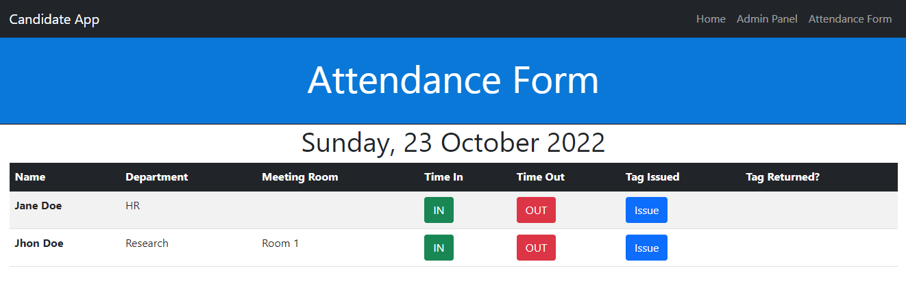

# CandidateApp

CandidateApp is a staff daily attendance form app for business.  This is the front end, made with React, Typescript and Bootstrap.  The backend made with Flask and SQLAlchemy interacts with a Postgres database, can be found [here](https://github.com/ajcastany/candidate1-backend).

## Admin Panel

For the facilities staff/administrator, it allows the administrator to add and remove staff on specific days and to edit each row.

## Staff Attendance

Staff self-sign in form, designed to be running on an tablet device at the entrance of the organization.  Allows staff to push a button to clock in and out, and manually their tag number, if any was issued.

## Usage

System administrator adds the entry for the day for each staff member using the **Admin Panel**.  Only the system administrator can assign a meeting room for each staff member.

Staff members can clock in, out and type in their tag number.  If they clock out when they have a tag number assigned to them, the app will remind them to return the tag.

System administrators can use the **Admin Panel** to edit all rows, add a custom time in or time out or erase information added to each row.  The administrator can also delete entries.

## Attendance Form

Designed to be used on an tablet device at the entrance of your organization to record staff attendance, clock in/out and record tag issues, if any.  The Attendance form opens the entries for the current day.

### Add a tag number

Click on **Issue**,type the tag number issued to the staff member, and click on **Issue** or press Enter:

The tag number is added to the form:

### Time in or Out

Tap or click on the **TIME IN** or **TIME OUT** buttons in the form.  The current time will be displayed.  The user cannot edit time in or out, only the system administrator can.

If there is a tag number assigned to staff when clocking out, it will pop up a reminder to return the tag.

## Admin Panel

### Select Day

Click on the current day to open the calendar and select the day for the attendance entry you want to add.

### Add new entry

click on **Add New Entry** button at the bottom of the page:

Start typing or select the name from the list and click **Create Entry**.

### Add meeting room

Click on Add meeting room and type the meeting room for the staff member:

### Edit time in or out

Click on the grey **Edit** or **Time IN**/**Time Out** to manually select the time.  You can also delete the Time entry by pressing the DELETE key on the keyboard.

### Issue or Edit tag Returned

The tag returned option only appears if a tag have been issued:

If the staff member has clocked out, the **Tag Returned** column changes to Yes/No.  System administrator can edit this value by clickintg on the Edit Button.

### Delete Entry

Clicking on the **Delete** button will delete the entire row:

1[deleted row](.github/images/deleted_row.png)
